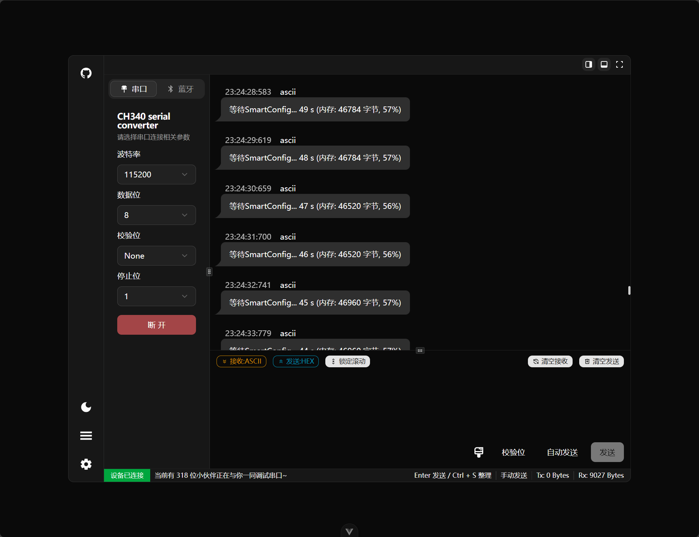

<p align="center">
    <h1 align="center">波特律动串口助手</h1>
    <h2 align="center">BaudDance Serial Assistant</h2>

</p>
<p align="center">
    <em>一个可以直接在浏览器中使用的串口助手工具</em><br>
    <em>A serial port assistant that can be used directly in the browser</em>
</p>

<p align="center">
    <a href="https://serial.baud-dance.com/">🌐 在线使用 / Online Demo</a>
</p>
<p align="center">
    <a href="https://serial.keysking.com/">🌐 备用链接 / Online Demo (Backup)</a>
</p>
<p align="center">
  
</p>
<br>
<p align="center">
  <a href="https://github.com/BaudDance/SerialAssistant">
    
  </a>
  <a href="https://github.com/BaudDance/SerialAssistant">
    
  </a>
  <br>
  <br>
  
  
  
  <br>
  
  
  <br>
  
  <br>
  <br>
</p>

## ✨ 特性 / Features

- 🌐 **浏览器原生支持** - 基于 Web Serial API 和 Web Bluetooth API，无需安装驱动
- 📱 **响应式设计** - 支持桌面端，自适应布局
- 🔌 **多种连接方式** - 支持 USB 串口和蓝牙连接
- 📊 **实时数据监控** - 实时显示串口数据收发记录
- 🎨 **现代化界面** - 基于 Vue 3 + Tailwind CSS 构建的美观界面
- ⚡ **高性能** - 使用 Rolldown-Vite 构建，支持热重载和快速开发
- 🛠️ **可定制** - 支持多种数据格式显示和发送选项

## 🚀 快速开始 / Quick Start

### 环境要求 / Prerequisites

- Node.js >= 22
- pnpm >= 10 (推荐使用 pnpm)
- 现代浏览器（支持 Web Serial API）

### 安装 / Installation

```bash
# 克隆项目
git clone <repository-url>
cd SerialAssistant

# 安装依赖
pnpm install

# 启动开发服务器
pnpm dev

# 构建生产版本
pnpm build
```

## 🚀 部署指南 / Deployment Guide

### Docker 部署 / Docker Deployment

项目提供了Docker支持，可以使用Docker快速部署应用。

```bash
# 使用Docker构建镜像
docker build -t serial-assistant .

# 运行容器
docker run -d -p 8080:80 --name serial-assistant serial-assistant
```

或者使用docker-compose：

```bash
# 使用docker-compose启动服务
docker-compose up -d
```

构建完成后，访问 http://localhost:8080 即可使用应用。

### Netlify 部署 / Netlify Deployment

项目支持一键部署到 Netlify，提供了完整的配置文件。

#### 方式一：使用 Netlify CLI

1. 安装 Netlify CLI

```bash
npm install -g netlify-cli
```

2. 登录 Netlify

```bash
netlify login
```

3. 初始化并部署项目

```bash
# 构建项目
pnpm build

# 部署到 Netlify
pnpm deploy:netlify
```

#### 方式二：通过 Netlify 网站部署

1. 在 [Netlify](https://www.netlify.com) 注册并登录账号
2. 点击 "New site from Git"
3. 选择 GitHub 并授权仓库访问权限
4. 选择要部署的仓库
5. 配置构建设置：
   - Build command: `pnpm build`
   - Publish directory: `dist`
   - Node version: `22`
6. 点击 "Deploy site"

部署完成后，Netlify 会自动分配一个域名。你也可以在站点设置中配置自定义域名。

### Vercel 部署 / Vercel Deployment

项目支持一键部署到 Vercel，提供了完整的配置文件。

#### 配置文件说明

**vercel.json** - 主要的 Vercel 配置文件，包含以下配置：

- **构建命令**: `pnpm run build`
- **输出目录**: `dist`
- **框架**: Vite
- **路由重写**: 支持 SPA 路由
- **缓存策略**: 静态资源长期缓存
- **Node.js 版本**: 22

**.vercelignore** - 指定部署时需要忽略的文件和目录，减少部署包大小。

#### 方式一：使用 Vercel CLI

1. 安装 Vercel CLI

```bash
npm i -g vercel
```

2. 登录 Vercel

```bash
vercel login
```

3. 部署项目

```bash
# 部署
pnpm deploy:vercel
# 或者
vercel --prod
```

#### 方式二：通过 Vercel Dashboard 部署

1. 访问 [Vercel Dashboard](https://vercel.com/dashboard)
2. 点击 "New Project"
3. 导入你的 Git 仓库
4. Vercel 会自动检测到这是一个 Vite 项目并使用相应配置
5. 点击 "Deploy" 开始部署

#### 方式三：通过 Git 集成自动部署

连接 Git 仓库后，每次推送到主分支都会自动触发部署。

#### 环境变量配置

如果项目需要环境变量，可以在 Vercel Dashboard 的项目设置中添加，或者通过 CLI 添加：

```bash
vercel env add VITE_API_URL
```

部署完成后，Vercel 会自动分配一个域名。你也可以在站点设置中配置自定义域名。

### 可用脚本 / Available Scripts

```bash
pnpm dev                # 启动开发服务器
pnpm build              # 构建生产版本
pnpm preview            # 预览构建结果
pnpm analyze            # 分析构建包大小
pnpm lint               # 代码检查
pnpm lint:fix           # 自动修复代码问题
pnpm test               # 运行单元测试
pnpm test:run           # 运行单元测试（单次）
pnpm deploy:docker      # 部署到Docker
pnpm deploy:netlify     # 部署到Netlify
pnpm deploy:vercel      # 部署到Vercel（生产环境）
```

## 🏗️ 技术栈 / Tech Stack

- **前端框架**: Vue 3 (Composition API)
- **构建工具**: Vite
- **样式框架**: Tailwind CSS 4.x
- **UI 组件**: Shadcn/Vue UI
- **状态管理**: VueUse (通过 composables)
- **工具库**: VueUse, Day.js
- **开发工具**: ESLint, Vitest

## 📁 项目结构 / Project Structure

```
src/
├── components/          # 组件目录
│   ├── ActivityBar/     # 活动栏组件
│   ├── ControlPanel/    # 控制面板
│   ├── RecordPanel/     # 数据记录面板
│   ├── SendPanel/       # 数据发送面板
│   ├── SettingPanel/    # 设置面板
│   ├── StatusBar/       # 状态栏
│   ├── TopBar/          # 顶部栏
│   └── ui/              # shadcn/vue UI组件
├── composables/         # 组合式函数
│   ├── useBle/          # 蓝牙功能
│   ├── useCheckDigit/   # 校验位功能
│   ├── useDataCode/     # 数据编码
│   ├── useLayout/       # 布局管理
│   ├── useNprocess/     # 进度条动画
│   └── useSerial/       # 串口功能
├── store/               # 状态管理
└── network/             # 网络监控
```

## 🔧 核心功能 / Core Features

### 串口连接 / Serial Connection

- 支持 Web Serial API
- 自动检测可用串口设备
- 可配置波特率、数据位、停止位等参数
- 实时数据收发

### 蓝牙连接 / Bluetooth Connection

- 支持 Web Bluetooth API
- BLE 设备连接和通信
- 自定义服务和特征值配置

### 数据处理 / Data Processing

- 支持多种数据格式（HEX、ASCII、UTF-8等）
- 实时数据显示和记录
- 自定义数据编码和解码

## 🌐 浏览器兼容性 / Browser Compatibility

| 功能              | Chrome | Edge   | Firefox | Safari |
| ----------------- | ------ | ------ | ------- | ------ |
| Web Serial API    | ✅ 89+ | ✅ 89+ | ❌      | ❌     |
| Web Bluetooth API | ✅ 56+ | ✅ 79+ | ❌      | ❌     |

> **注意**: 此应用需要支持 Web Serial API 的浏览器，目前主要支持基于 Chromium 的浏览器。

## 📋 TODO

- [ ] 使用 Worker 重构数据处理
- [ ] SEO 优化
- [ ] 修复 RTS 拉高部分板子 boot0 的问题
- [x] 点击时间切换时间显示格式
- [x] 对话气泡复制按钮
- [ ] 对话记录保存功能
- [x] 快捷输入按钮面板
- [ ] 快捷发送键绑定（如 WASD 等按键）
- [ ] 数据曲线绘制（自定义正则表达式或 JS 脚本提取数据）
- [ ] 搜索功能
- [ ] 命令行样式的彩色显示（类似 \033[30m）
- [ ] 关键词彩色高亮
- [ ] 添加随机小贴士
- [ ] 添加缓存限制防止数据过多导致卡顿

## 📈 项目趋势 / Star History

<p align="center">
  <a href="https://star-history.com/#BaudDance/SerialAssistant">
    <picture>
      <source media="(prefers-color-scheme: dark)" srcset="https://api.star-history.com/svg?repos=BaudDance/SerialAssistant&type=Date&theme=dark" />
      <source media="(prefers-color-scheme: light)" srcset="https://api.star-history.com/svg?repos=BaudDance/SerialAssistant&type=Date" />
      
  </picture>
  </a>
</p>

## 🤝 贡献 / Contributing

欢迎提交 Issue 和 Pull Request！

1. Fork 本仓库
2. 创建特性分支 (`git checkout -b feature/AmazingFeature`)
3. 提交更改 (`git commit -m 'Add some AmazingFeature'`)
4. 推送到分支 (`git push origin feature/AmazingFeature`)
5. 打开 Pull Request

## 📄 许可证 / License

本项目采用 MIT 许可证 - 查看 [LICENSE](LICENSE) 文件了解详情。

## 🙏 致谢 / Acknowledgments

- [Web Serial API](https://developer.mozilla.org/en-US/docs/Web/API/Web_Serial_API)
- [Web Bluetooth API](https://developer.mozilla.org/en-US/docs/Web/API/Web_Bluetooth_API)
- [Vue.js](https://vuejs.org/)
- [Vite](https://vitejs.dev/)
- [Tailwind CSS](https://tailwindcss.com/)

---

<p align="center">
    <em>Powered by 波特律动</em>
</p>
